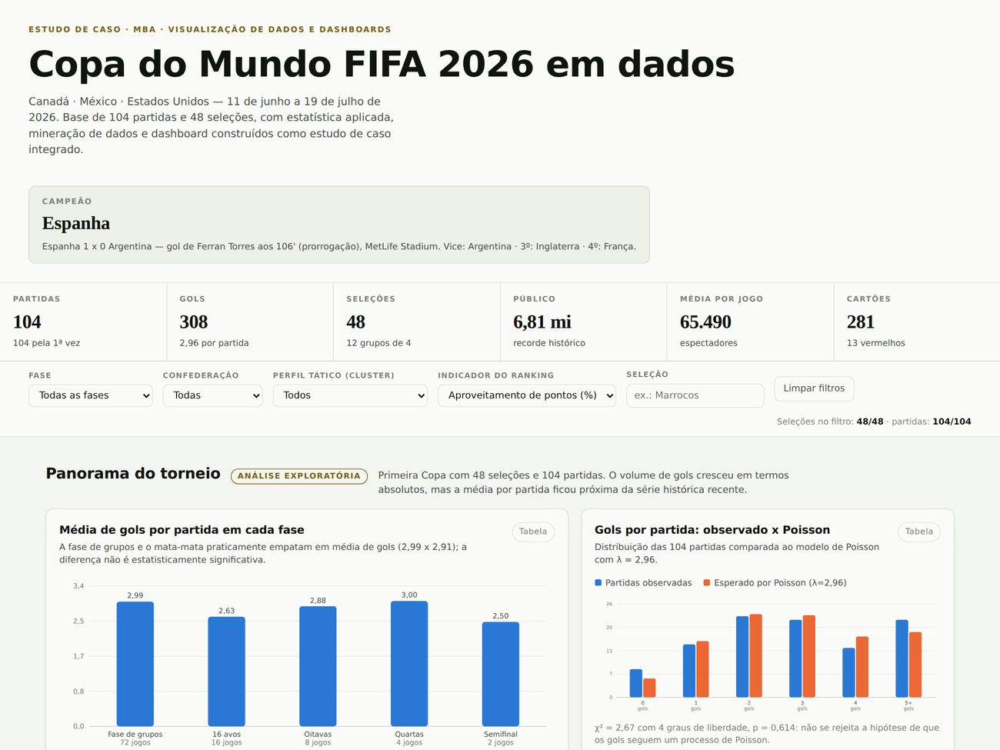
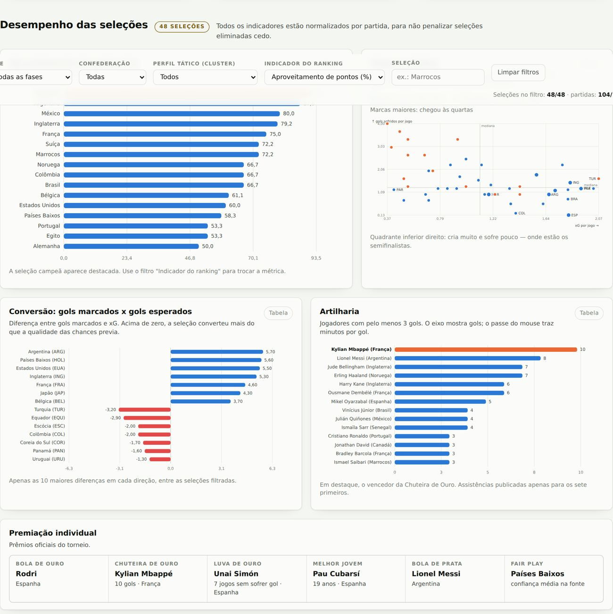
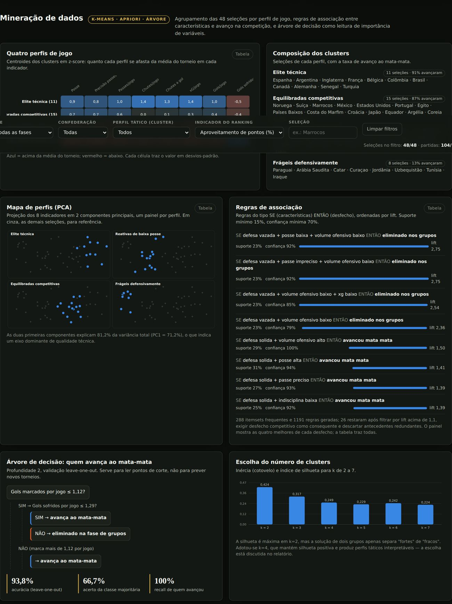

# Copa do Mundo FIFA 2026 — da base de dados ao dashboard

Estudo de caso para a disciplina Visualização de Dados e Elaboraçãode Dashboards
ESTUDO DE CASO – COPA DO MUNDO FIFA 2026

**Disciplina:** Visualização de Dados e Elaboração de Dashboards **Professor:** Dr. José Remo Ferreira Brega
· **Aluno:** Carlos Rodrigues · Agosto de 2026



---

## Índice

- [Resultado em uma frase](#resultado-em-uma-frase)
- [Dashboard](#dashboard)
- [Estrutura do repositório](#estrutura-do-repositório)
- [Como reproduzir](#como-reproduzir)
- [A base de dados](#a-base-de-dados)
- [Validação da base](#validação-da-base)
- [Técnicas aplicadas](#técnicas-aplicadas)
- [Principais resultados](#principais-resultados)
- [Decisões de visualização](#decisões-de-visualização)
- [Limitações](#limitações)
- [Fontes](#fontes)

## Resultado em uma frase

Solidez defensiva e volume ofensivo qualificado — **não** posse de bola por si só — são os
fatores associados ao avanço na competição. Três técnicas independentes (teste de Mann-Whitney,
regras de associação e árvore de decisão) convergem para o mesmo par de variáveis.

## Dashboard

`saida/dashboard_copa2026.html` é um **arquivo único autocontido**: os dados tratados estão
embutidos como JSON e todos os gráficos são gerados em SVG por código próprio, sem bibliotecas
externas nem servidor. Basta abrir no navegador — funciona offline.

Para publicar como página: em **Settings → Pages**, selecione a branch e a pasta `/docs`.
O dashboard é servido em `https://<usuário>.github.io/<repositório>/`
(`docs/index.html` é uma cópia do painel).

| | |
|---|---|
|  |  |
| Desempenho das seleções, tema claro | Mineração de dados, tema escuro |

Doze painéis, filtros que governam a página inteira (fase, confederação, perfil tático,
indicador e busca), tabela equivalente para cada gráfico e suporte aos temas claro e escuro.

## Estrutura do repositório

```
codigo/     pipeline completo (Python + Node)
dados/      dados brutos coletados (JSON) e bases tratadas (CSV) + auditoria
saida/      dashboard, relatório (.docx e .pdf) e resultados analíticos (JSON)
docs/       capturas de tela e cópia do dashboard para o GitHub Pages
```

| Arquivo | O que é |
|---|---|
| `codigo/01_preparacao_dados.py` | Limpeza, integração das três bases, criação de indicadores e validação |
| `codigo/02_estatistica.py` | Descritiva, aderência a Poisson, correlações, Mann-Whitney, associação |
| `codigo/03_mineracao.py` | K-Means, PCA, Apriori e árvore de decisão |
| `codigo/04_exporta_dashboard.py` | Consolida o payload JSON do dashboard |
| `codigo/05_gera_dashboard.py` | Injeta os dados no template e gera o HTML |
| `codigo/06_teste_dashboard.py` | Verificação em navegador headless (erros, filtros, temas, rolagem) |
| `codigo/07_gera_relatorio.js` | Gera o relatório `.docx` a partir dos resultados analíticos |
| `codigo/template_dashboard.html` | Template do dashboard (CSS + engine de gráficos em SVG) |
| `saida/relatorio_copa2026.docx` | Relatório final, 15 páginas |
| `dados/validacao.txt` | Relatório de auditoria da base |

## Como reproduzir

```bash
pip install pandas numpy scipy scikit-learn mlxtend playwright
npm install docx        # apenas para gerar o relatório

python codigo/01_preparacao_dados.py
python codigo/02_estatistica.py
python codigo/03_mineracao.py
python codigo/04_exporta_dashboard.py
python codigo/05_gera_dashboard.py
python codigo/06_teste_dashboard.py     # opcional
node   codigo/07_gera_relatorio.js
```

Cada script imprime os resultados no terminal e grava os arquivos em `dados/` ou `saida/`.
**Nenhum número do relatório é digitado à mão:** todos são lidos dos JSON gerados pelas etapas 2 e 3,
de modo que uma correção nos dados se propaga automaticamente para o relatório e para o dashboard.

## A base de dados

Não existe base pública consolidada e legível por máquina da Copa de 2026: o site oficial da FIFA
renderiza as tabelas por JavaScript e a Wikipédia, na data da coleta, ainda apresentava conteúdo
anterior ao torneio no cache acessível. A base foi construída a partir de **53 endereços de fontes
públicas**, com confirmação em pelo menos duas fontes independentes por informação.

| Arquivo | Conteúdo |
|---|---|
| `dados/partidas.csv` | 104 partidas: fase, grupo, rodada, data, estádio, placar, prorrogação, pênaltis, vencedor |
| `dados/partidas_selecao.csv` | 208 registros — uma linha por seleção por partida (formato longo) |
| `dados/selecoes.csv` | 48 seleções × 46 colunas: campanha, indicadores técnicos, indicadores criados, classificação, cluster, coordenadas PCA |
| `dados/artilharia.csv` | 28 jogadores com 3 gols ou mais |
| `dados/raw_*.json` | Dados brutos como coletados, com registro de fontes e lacunas |

Todos os indicadores comparativos são normalizados **por partida** — as seleções disputaram entre
3 e 8 jogos, e usar totais penalizaria quem foi eliminado cedo.

## Validação da base

A base não depende da concordância entre fontes: ela é auditada por **consistência interna**.

| Teste | Resultado |
|---|---|
| Reconstrução das 48 linhas das tabelas de grupo a partir dos 72 placares | 0 divergências |
| Gols pró e contra por seleção: soma das partidas × tabela agregada da fonte | 0 divergências |
| Total de gols das 104 partidas × total divulgado independentemente | 308 = 308 |
| Jogos disputados × fase alcançada (coerência estrutural) | 0 divergências em 48 |
| Empates no mata-mata sem registro de pênaltis | 0 casos |

Esse teste é mais forte que a checagem cruzada e detectou erros reais em duas fontes: um veículo
publicava pontuações incompatíveis com os próprios placares e outro invertia dois resultados do Grupo J.

## Técnicas aplicadas

**Estatística** — descritiva completa; teste de aderência a Poisson (χ² = 2,67, p = 0,614);
correlação de Pearson (xG × gols: r = 0,92) e de Spearman com a classificação final;
Mann-Whitney U entre as 32 seleções que avançaram e as 16 eliminadas, com tamanho de efeito;
qui-quadrado e V de Cramér para associação entre variáveis categóricas.

**Mineração de dados** — K-Means (4 perfis, z-score, diagnóstico por cotovelo e silhueta);
PCA para visualização e diagnóstico (81,2% da variância em 2 componentes);
Apriori com poda de regras redundantes; árvore de decisão com validação leave-one-out.

## Principais resultados

1. **Defesa é o fator dominante.** Defesa sólida combinada a volume ofensivo alto levou 14 de 14
   seleções ao mata-mata (confiança 100%, lift 1,50). Manter a meta invicta multiplica por 2,53 a
   probabilidade de vitória (χ² = 30,7, p < 0,001).
2. **Posse de bola é meio, não fim.** Correlaciona-se com o resultado (ρ = 0,63), mas é o mais fraco
   dos indicadores ofensivos e não aparece isolada em nenhuma regra de associação. Ter mais posse que
   a média não acrescenta vantagem — o tercil intermediário avançou tanto quanto o superior.
3. **Volume qualificado, não pontaria.** Chutes a gol por jogo separam quem avançou de quem caiu
   (p < 0,001); a precisão de finalização não separa (p = 0,186).
4. **Quatro perfis de jogo**, com taxas de avanço de 91%, 87%, 57% e 13%. A fronteira decisiva não
   está entre a elite técnica e as equilibradas competitivas, mas entre estas e as seleções de defesa vazada.
5. **Duas variáveis classificam 45 das 48 seleções:** marcar mais de 1,12 gol por jogo, ou sofrer no
   máximo 1,29 quando se marca menos (93,8% de acurácia em leave-one-out, contra 66,7% da classe majoritária).
6. **O xG explica 85% dos gols marcados** — e o resíduo tem nome: Argentina (+5,7), Países Baixos (+5,6)
   e Estados Unidos (+5,5) converteram acima do esperado; Turquia (−3,2) e Equador (−2,9) desperdiçaram
   o que criaram, e caíram na primeira fase apesar de criação compatível com o mata-mata.
7. **A produção de gols seguiu um processo de Poisson**, apesar do formato novo e da maior desigualdade
   entre adversários — o que sustenta tratar o torneio com os modelos usuais de futebol.

## Decisões de visualização

O relatório (seção 5) registra painel por painel a forma escolhida e **a alternativa recusada**.
Em resumo:

- **Forma pela tarefa visual**, não por variedade: barras horizontais para magnitude com rótulos
  longos, dispersão com linhas de mediana para relação entre duas contínuas, dumbbell para distância
  entre dois grupos, barras divergentes quando o sinal é a informação, mapa de calor para matriz
  perfil × indicador. Recusados: pizza com 48 categorias, eixo duplo, radar.
- **Paleta validada programaticamente** — faixa de luminosidade, piso de croma, separação sob
  protanopia, deuteranopia e tritanopia (ΔE ≥ 9,2 em OKLab) e contraste contra a superfície, nos dois
  temas. Nas dispersões, o número de séries é limitado a duas e os quatro perfis foram separados em
  painéis pequenos justamente porque quatro matizes simultâneos não passariam no teste.
- **Cor nunca carrega significado sozinha:** legenda em todo painel com duas ou mais séries, rótulos
  diretos seletivos e tabela equivalente acessível em cada gráfico.
- **Uma única linha de filtros** governa todos os painéis, com contador do recorte ativo. Filtros
  dentro de cartões individuais foram deliberadamente evitados.
- **Dois temas** definidos por variáveis em três escopos (claro, preferência do sistema, escolha
  explícita do leitor); o tema escuro tem passos próprios das mesmas matizes, validados contra a
  superfície escura — não é inversão automática.

## Limitações

- Faltas cometidas por seleção não são publicadas por nenhuma fonte acessível.
- Assistências individuais existem apenas para os sete primeiros artilheiros.
- O mando de campo divergia entre fontes em cerca de dez partidas da fase de grupos; os placares não
  são afetados e nenhuma análise usa mando de campo como variável explicativa.
- Os gols esperados (xG) vêm de um provedor único, com modelo proprietário, sem segunda fonte para
  validação cruzada.
- A classificação geral da FIFA foi publicada como ordem, sem os pontos exatos; é usada como variável ordinal.

## Fontes

FIFA (match centre e artigos de pós-torneio), FOX Sports, CBS Sports, NBC Sports, Yahoo Sports, ESPN,
worldfootball.net, Sky Sports, FourFourTwo, Al Jazeera, The Analyst/Opta, Britannica, LiveScore,
entre outras. A relação completa dos 53 endereços está no rodapé do dashboard e na seção 9 do relatório.

## Licença

Código sob licença MIT (ver `LICENSE`). Os dados são fatos esportivos de domínio público, compilados
das fontes citadas; o relatório é trabalho acadêmico do autor.
